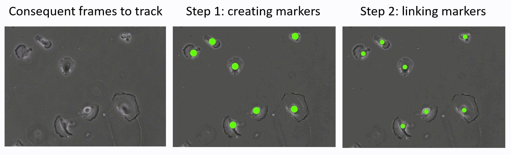
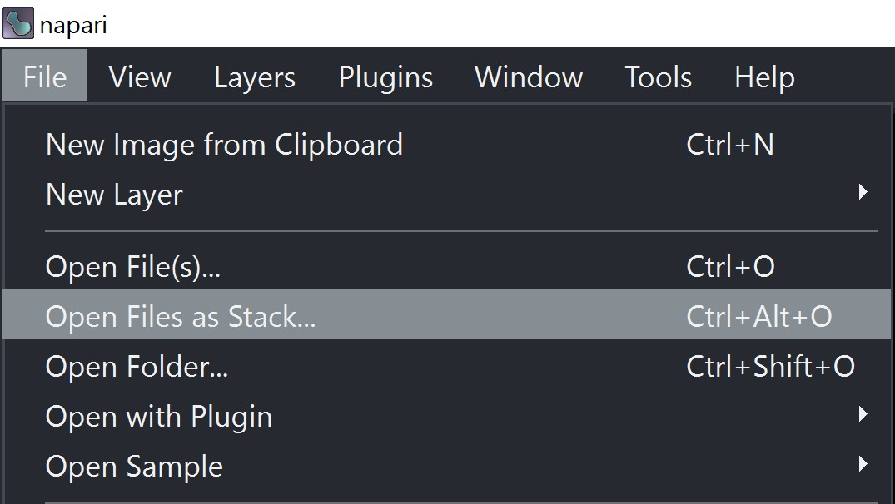
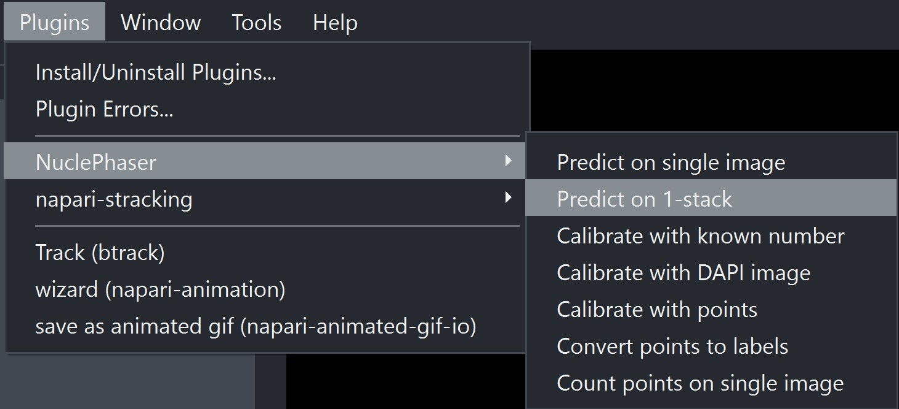
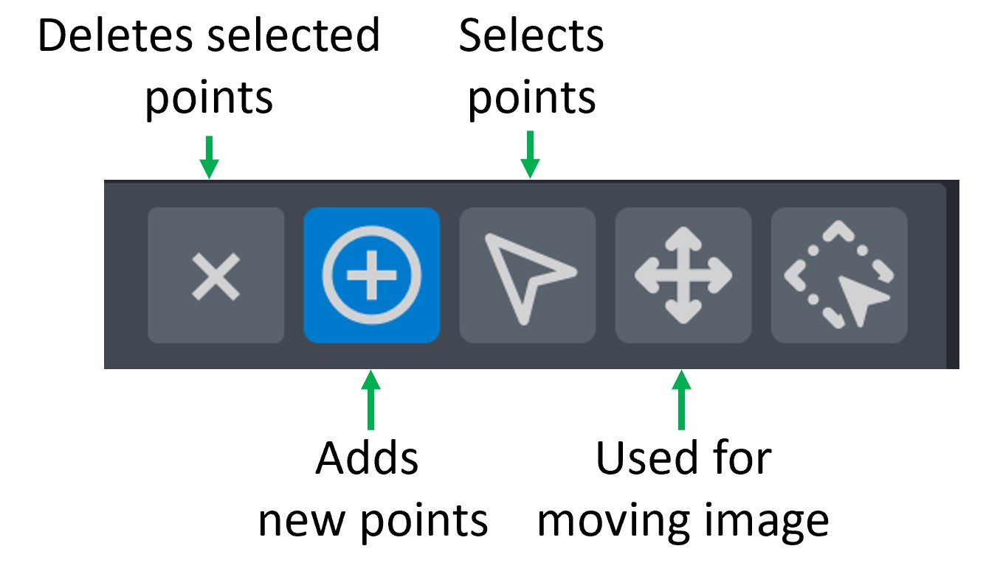

Individual cells tracking
=========================

This page provides step-by-step guideline for using NuclePhaser for generating tracking markers.

Individual cell tracking is typically divided into two tasks: generating tracking markers and linking them.
NuclePhaser provides an option for generating markers, the task of linking them is outside of the NuclePhaser scope.
There are various plugins in Napari for that, we especially recommend `btrack <https://github.com/quantumjot/btrack>`_.

        Two steps in automatic objects tracking. Frames are taken from `Cell Tracking Challenge <https://celltrackingchallenge.net/>`_. Markers are created with NuclePhaser.

The task of individual cell tracking is challenging.
It's due to the fact that tracking markers should be **extremely** stable across frames, with single false positive or false negative ruining the whole track.
The only way to be 100% sure in tracks is to check tracking markers or result tracks manually.

We suggest using NuclePhaser not as a standalone tracking markers generator, but as an assistant to manual tracking, since manual inspection is inevitable.
Although, as we showed in our `paper <https://www.biorxiv.org/content/10.1101/2025.05.13.653705v1>`_, NuclePhaser is capable of generating markers for fully automated tracking without manual inspection,
we're aware that in a real world scenario it's better to check everything manually.

The pipeline we're suggesting is simple: NuclePhaser generates draft markers, and user manually corrects them.
This will result in a **manual tracking level of quality** with **much less time** spent on manual annotation, since correcting a few false detections is much faster than marking all objects by hand.
Napari provides a convenient way for correcting the annotations, so below is the full step-by-step guideline.

Step 1. Choose the model and confidence threshold you want to use.

About **models**: in the row n-s-m-l-x n is the most small and fast, while x is the most large and slow.
If you have a large movie with a lot of cells, consider using smaller models.
In our practice, they are as good in accuracy as large (sometimes, subjectively, even better).

About **confidence threshold**. If you are aiming for fully automated tracking, you can run a calibration algorithm described in :doc:`Population growth curves guideline </Biological tasks guidelines/Population growth curves>`.

But if you will manually correct the result annotations, you can shift confidence threshold depending on what you want to do.
If you want to correct annotations by adding missing ones, you can set **higher** confidence threshold, so the model will miss more, but generate less extra.
If you want to delete extra annotations, you can set **lower** confidence threshold.
In our practice, drawing missing markers in much easier, so we're suggesing higher confidence threshold.

You can estimate the quality and experiment with confidence threshold by opening single image from your movie and running prediction with :doc:`Predict on single image widget </Widgets/Predict on single image>`.

Step 2. Open your movie as stack of images in Napari.

        Button for opening images as stack.

Step 3. Open **Predict on 1-stack** widget in NuclePhaser

        Widget location.

Step 4. In the **Select stack** field, select your opened stack of images.

Step 5. In **Select model** and **Confidence threshold** fields, enter model and confidence threshold you selected in Step 1.

Step 6. (Optional). Other parameters in the widget are optional. Learn more about them at :doc:`Predict on 1-stack page </Widgets/Predict on 1-stack>`.

Step 7. Turn off the **Save result** checkmark. It will save count result in the selected folder, which is used when the task is to count objects.

Step 8. Press **Predict**.

.. warning:: This algorithm can take a long time to run!

Surprisingly, the most influential factor on waiting time is **number of objects on an image**.
It's due to the fact that postprocess algorithm (NMS or NMM) has O(n\ :sup:`2`) `notation <https://en.wikipedia.org/wiki/Big_O_notation>`_, so it can take much more time than applying the deep learning algorithm itself.
In our practice, inference time for one image exceeds 10-20 minutes when there are close to 100,000 objects on an image.

.. hint:: You can track the process in the command line that you used to initiate the Napari (not available in standalone application). It provides an estimated time to process the whole stack.

.. figure:: ../Images/Stack_CLI.jpg
        :scale: 50 %
        :align: center
        :alt: The image didn't load(

        Widget prints the process of running the algorithm in the command line that was used to initiate the Napari.

Step 9. Correct the result Points using `Napari set of tools <https://napari.org/dev/howtos/layers/points.html>`_.
Circle with plus sign inside (Second tool) is used for adding new points.
Use arrow (Third tool) to select extra points (with pressed Ctrl to select several) and Delete button or Cross (First tool) to remove extra markers.

        Napari set of tools to edit Points layer.

Step 10. Convert Points layer to format that is acceptable by your tracking algorithm.
For example, `btrack <https://github.com/quantumjot/btrack>`_ is using Labels layer.
Use NuclePhaser **Convert points to labels** widget to do that.

At the end, you will have set of labels that can be used by linker algorithms!

.. hint:: Save the result Points layer with File - Save selected layers. If you will find some mistake with tracks themselves, you can return to Points, correct mistakes and run linker algorithm again!
