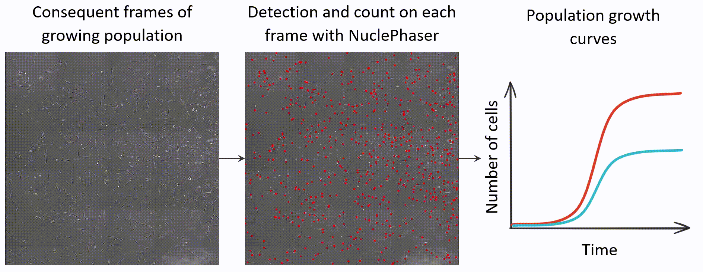
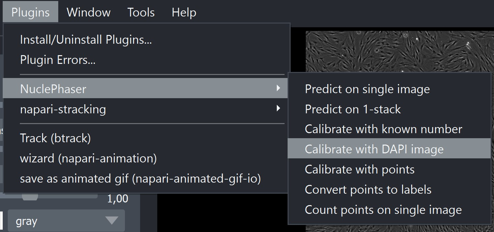
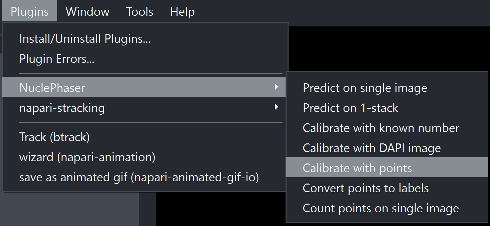
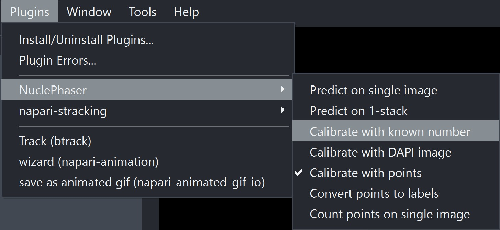

Population growth curves
========================

This page provides step-by-step guideline on how to count the number of cells in a stack of images to derive a population growth curve.
If you capture timelapse series of images of growing population of cells, you can count the number of cells on each image with NuclePhaser!
It will take two steps: calibrating the model for your specific use case and applying it to your stack of images

        NuclePhaser allows building growth curves based on consequent images of growing population.

Step 1: Calibrating the model
+++++++++++++++++++++++++++++

For the responsible use of method, NuclePhaser supports tuning and evaluating accuracy of the model for each specific use case.
So you can be sure you're using the right method by knowing the exact accuracy with which you evaluate population growth on each new stack of images!
It is done with Confidence threshold calibration (learn more at :doc:`Confidence threshold calibration </General information/Confidence threshold calibration>` page).
You have 3 options of doing that:

.. figure:: ../Images/Calibration_methods.png
        :scale: 9 %
        :align: center
        :alt: The image didn't load(

        Calibration methods available at NuclePhaser.

Option 1: Using fluorescent nuclei stain
----------------------------------------

.. note:: You need large images for that option, the larger - the better. At least 6400x6400 pixels is recommended.

The best option for calibration is staining the sample with DAPI or other fluorescent nuclei dye.
You need to obtain a pair of large brightfield-fluorescent images for calibration.
Brightfield imaging options (camera, illumination etc.) should be the same as in the experiment.

Step 1. Open brightfield and fluorescent calibration images in Napari as separate images. Images should have same sizes.

Step 2. Open **Calibrate with DAPI image** widget in NuclePhaser.

        Widget location.

Step 3. In the opened widget, select corresponding Brightfield and Fluorescent images in **Select Phase image** and **Select DAPI image** fields.

        Fields for selecting images.

Step 4. In the **Phase model** field, select the model that you want to calibrate.

Step 5. In the **DAPI model** field, select the fluorescent nuclei detection model that will act as a perfect (comparison) predictor.
In default napari-nuclephaser installation package there is **Fluorescent nuclei detectors** folder with models that extremely accurately detect fluorescent nuclei.

Step 6. Choose **Division size**. The large image will be split into small ones (see :ref:`Test after calibration <Test_after_calibration>`).
Division size determines the size of one small image.
For example, if your large image is 6400x6400 pixels and the division size is 640, your large image will be split into 100 small ones.

.. tip:: Division size can significantly affect the result measured accuracy! It happens because the larger the image, the more balanced false positives are with false negatives. Try increasing the division size if you see that your results in high MAPE and small amount of objects per image on accuracy scatterplot.

Step 7. Choose **Calibration proportion**. It determines a part of small images stack that will be used for calibration, the rest will be used for test.
For example, if your large image was split into 100 of small ones, with Calibration proportion = 0,1 10 of those images will be used for calibration, 90 - for test.
The final confidence threshold will be calculated as the mean optimal confidence threshold found for 10 images.

Step 8. Choose **DAPI confidence threshold**. You can test how well fluorescence model is detecting nuclei at your fluorescence image beforehand with Predict on single image widget.

Step 9 (Optional). Other parameters in the widget are optional. Learn more about them at :doc:`Calibrate with DAPI image widget page </Widgets/Calibrate with DAPI>`.

Step 10. Choose the folder for saving the results (**Save folder**) and the **Experiment name**.
Calibration algorithm will create a subfolder with Experiment name at given location with detailed results and metadata for reproducibility.

Step 11. Press **Calibrate**.

The calibration and test algorithms can take some time to run. You can track the process in the command line that you used to initiate the Napari (not available in standalone application).

You can find the optimal threshold for the model you selected in the line below the Calibrate button, in the folder that you selected (both Calibration error plot.png and metadata.txt files have it) or in the command line.

Option 2: Using manual annotations
---------------------------------

.. note:: You need a large image for that option, the larger - the better. At least 6400x6400 pixels is recommended.

If you don't have a fluorescent nuclei image, you can manually mark all the nuclei for calibration!

Step 1. Open your brightfield calibration image in Napari.

Step 2. Create **Points** layer, where all nuclei are marked with points. You have two options of doing that:

* Manually label all the nuclei. Above the image layer icon on the left, press the New point layer button (the left one with six dots). Use `Napari set of tools <https://napari.org/dev/howtos/layers/points.html>`_ to label all the nuclei.
* Manually correct annotations of uncalibrated model. Use **Predict on single image** with arbitrary confidence threshold and correct the result Points layer using `Napari set of tools <https://napari.org/dev/howtos/layers/points.html>`_. In our practice, adding missing points is more convenient than deleting extra, so we use higher confidence threshold.

.. figure:: ../Images/Napari_tools.jpg
        :scale: 40 %
        :align: center
        :alt: The image didn't load(

        Napari set of tools to edit Points layer. Circle with plus sign inside (Second tool, shortcut 2 or P) is used for adding new points. Use arrow (Third tool, shortcut 3 or S) to select extra points (with pressed Ctrl to select several) and Delete button or Cross (First tool, shortcut 1) to remove extra markers.

Step 3. Open **Calibrate with points** widget in NuclePhaser

        Widget location.

Step 4. In **Select Phase image** and **Select Points layer** select your calibration image and Points layer.

Step 5. In the **Phase model** field, select the model that you want to calibrate.

Step 6. Choose **Division size**. The large image will be split into small ones (see :ref:`Test after calibration <Test_after_calibration>`).
Division size determines the size of one small image.
For example, if your large image is 6400x6400 pixels and the division size is 640, your large image will be split into 100 small ones.

.. tip:: Division size can significantly affect the result measured accuracy! It happens because the larger the image, the less there will be difficult detections at the border, and the more balanced false positives are with false negatives. Try increasing the division size if you see that your results in high MAPE and small amount of objects per image on accuracy scatterplot.

Step 7 (Optional). Other parameters in the widget are optional. Learn more about them at :doc:`Calibrate with points widget page </Widgets/Calibrate with points>`.

Step 8. Choose the folder for saving the results (**Save folder**) and the **Experiment name**.
Calibration algorithm will create a subfolder with Experiment name at given location with detailed results and metadata for reproducibility.

Step 9. Press **Calibrate**.

The calibration and test algorithms can take some time to run. You can track the process in the command line that you used to initiate the Napari (not available in standalone application).

You can find the optimal threshold for the model you selected in the line below the Calibrate button, in the folder that you selected (both Calibration error plot.png and metadata.txt files have it) or in the command line.

Option 3. Using small image
---------------------------

If you don't have a large image for calibration, you can use a small one.

.. warning:: This method will not produce accuracy metrics!

Step 1. Open your brightfield calibration image in Napari.

Step 2. Manually count the number of nuclei on your calibration image. You can use `Napari Points layer <https://napari.org/dev/howtos/layers/points.html>`_ and **Count points on single image** widget.

Step 3. Open **Calibrate with known number** widget.

        Widget location.

Step 4. In the **Select image** field select your calibration image.

Step 5. In the **Select model** field, select the model that you want to calibrate.

Step 6. In the **Calibration number** field, enter the number of objects you counted in step 2.

Step 7 (Optional). Other parameters in the widget are optional. Learn more about them at :doc:`Calibrate with known number page </Widgets/Calibrate with known number>`.

Step 8. Press **Calibrate**.

This calibration algorithm is fast and should quickly provide the result optimal confidence threshold in the line below the **Calibrate** button.

.. note:: If the accuracy isn't high enough, there are several ways of increasing it. You can finetune NuclePhaser model using `Colab notebook <https://colab.research.google.com/drive/1hKMVQqYS0I_GrkYvdz23tPc8FCv2oJvh?usp=sharing>`_, as well as use :doc:`TTA </General information/Test-time augmentations (TTA)>` or :doc:`Dynamic confidence threshold </General information/Dynamic confidence threshold>`.

Step 2: Applying the calibrated model to a stack of images
++++++++++++++++++++++++++++++++++++++++++++++++++++++++++

Once you have optimal confidence threshold for your specific use case and you deemed calibrated model's accuracy as acceptable, you can apply (run inference) the calibrated model to your stack of images.

Step 1. Open your images as stack in Napari.

.. figure:: ../Images/Open_stack.jpg
        :scale: 50 %
        :align: center
        :alt: The image didn't load(

        Button for opening images as stack.

Step 2. Open **Predict on 1-stack** widget in NuclePhaser

.. figure:: ../Images/Predict_on_one_stack.jpg
        :scale: 50 %
        :align: center
        :alt: The image didn't load(

        Widget location.

Step 3. In the **Select stack** field, select your opened stack of images.

Step 4. In the **Select model** field, select the model that you calibrated.

Step 5. In the **Confidence threshold** field, enter the optimal confidence threshold that you calculated during calibration.

Step 6. (Optional). Other parameters in the widget are optional. Learn more about them at :doc:`Predict on 1-stack page </Widgets/Predict on 1-stack>`.

Step 7. Keep the Save result checkmark. It is supposed to be turned off if the task is tracking.

Step 8. Choose the folder for saving the results (**Save folder**) and the **Experiment name**.
Inference algirthm will create a subfolder with Experiment name at given location with detailed results and metadata for reproducibility.

Step 9. Choose the format for saving the count results: **.csv** or **.xlsx**. You can choose both!

Step 10. Press **Predict**.

.. warning:: This algorithm can take some time to run!

In the end, you will have .csv or .xslx file with count results that you can use for further processing and plotting graphs!
