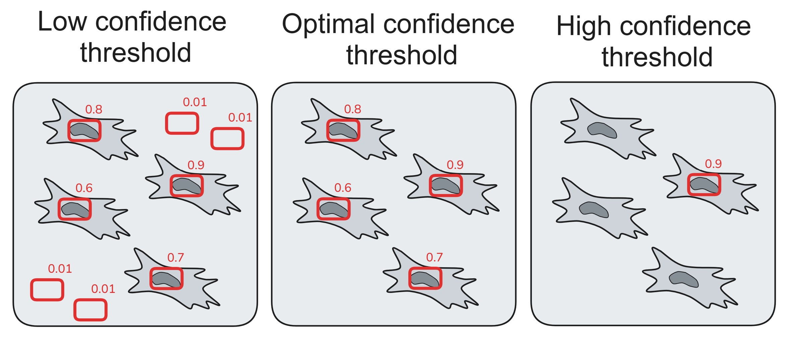
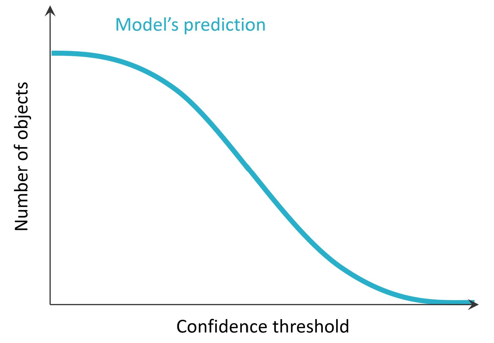
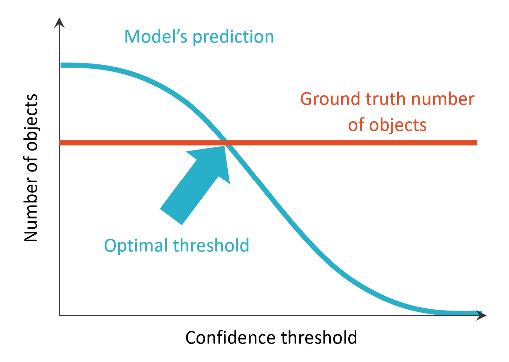
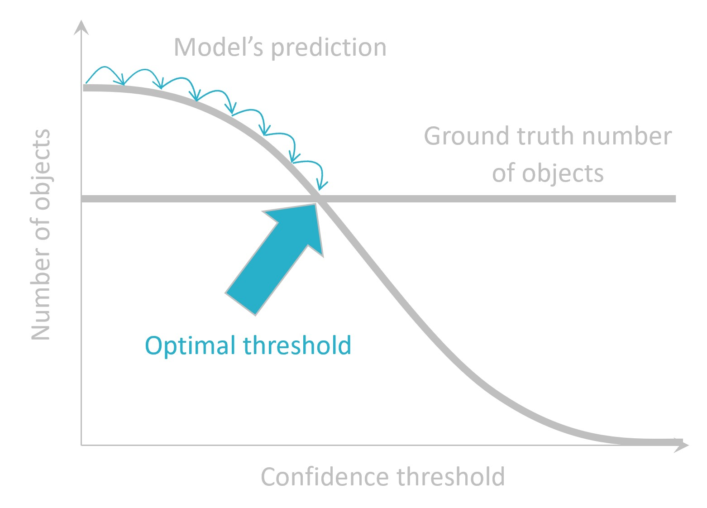
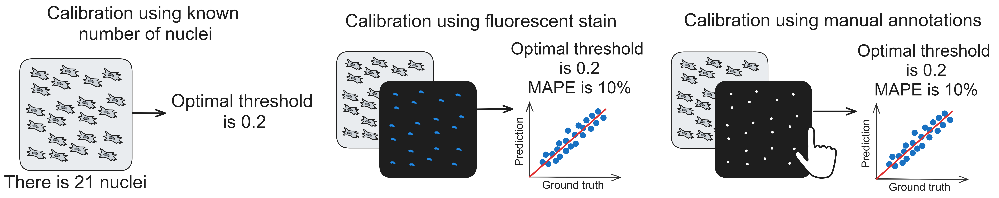
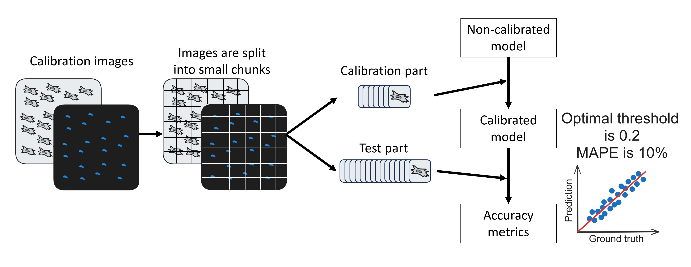

Confidence threshold calibration
================================

What is confidence threshold?
++++++++++++++++++++++++++++

Apart from bounding boxes, object detection models return **confidence scores** for each object (see :doc:`Object detection section </General information/Object detection overview>`).
Before each inference (model application to an image), user should set a **confidence threshold** parameter.
Objects with confidence score lower than confidence threshold will not be included in the final set of predictions.

Therefore, confidence threshold is crucial to the number of returned objects and should be carefully considered when task is to count the number of objects on an image.

        Low, optimal and high confidence thresholds and their consequences regarding number of returned objects.

In other words, confidence threshold and number of objects relation can be presented as the following plot:

        Plot representing how confidence threshold is crucial to the number of objects.
        Low confidence threshold leads to a high number of predictions, and in reverse.

But if we know the ground truth number of objects on an image, we can try to find the optimal confidence threshold!

        There is one optimal threshold returning the ground truth number of objects.

In NuclePhaser, if the ground truth number of object is known (see below), the optimal threshold is found with iterative search starting from the lowest:

        Iterative search of optimal confidence threshold.

Behind the scenes, it happens by running inference only one time with the lowest confidence threshold (0.01).
Then the result predictions are filtered by increasing confidence threshold until reaching the ground truth number.
Since the prediction is performed only once, calibration process is very fast!

This process allows **tuning models** for specific use cases: cells, illumination options, etc., without training!

How to know the ground truth number?
++++++++++++++++++++++++++++++++++++

In NuclePhaser, there are three options of passing a ground truth number of cells to calibration algorithm:

1. Explicitly pass known number of objects. **Calibrate with known number** widget is used for that.
More suitable if you have only **small image** for calibration, since it doesn't run test and produce accuracy metrics (see below).
See more at :doc:`Calibrate with known number widget page </Widgets/Calibrate with known number>`.

2. With paired fluorescent nuclei image. **Calibrate with DAPI** widget is used for that.
We trained a fluorescent nuclei detection models that are very accurate, since detecting bright circles on black background is a simple computer vision task.
These models can be used as "perfect predictors". See more at :doc:`Calibrate with DAPI widget page </Widgets/Calibrate with DAPI>`.

3. With manual detection of nuclei. **Calibrate with points** widget is used for that.
If you don't have fluorescent nuclei image, you can manually mark all the nuclei! See more at :doc:`Calibrate with points widget page </Widgets/Calibrate with points>`.

.. tip:: Instead of marking all nuclei manually, you can run prediction with uncalibrated model with :doc:`Predict on single image widget </Widgets/Predict on single image>` and then correct the wrong detections. It is much faster than do everything manually!

        Calibration methods available at NuclePhaser.

.. _Test_after_calibration:

Test after calibration
++++++++++++++++++++++

Optimizing confidence threshold doesn't guarantee that model will work with 100% accuracy.
We implemented an algorithm that tests the performance of calibrated model.
For convenience, we merged calibration and testing algorithms together, so **Calibrate with DAPI** and **Calibrate with points** widgets automatically run tests.
For that, pass a **large image** for calibration. It will be sliced into smaller chunks, a part of it will be used for calibration, and the rest - for test.
For more information, see :doc:`Calibrate with DAPI widget page </Widgets/Calibrate with DAPI>` and :doc:`Calibrate with points widget page </Widgets/Calibrate with points>`.

        Workflow diagram of calibration and testing algorithms. **Calibrate with DAPI** and **Calibrate with points** are working this way.

Two metrics are generated during tests: `MAPE <https://en.wikipedia.org/wiki/Mean_absolute_percentage_error>`_ and prediction-ground truth scatterplot.
The smaller the MAPE, the better. The closer predictions to the red line on scatterplot, the better.
For more detailed information about the metrics, see our `paper <https://www.biorxiv.org/content/10.1101/2025.05.13.653705v1>`_.
