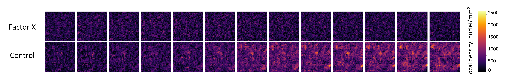
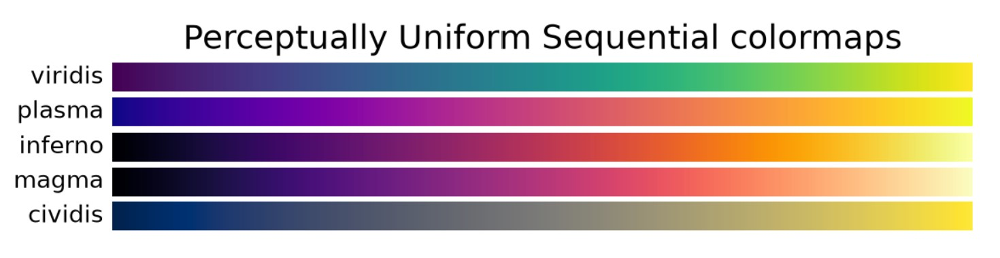

Density maps
============

.. attention::
    This is an **optional post-processing step**. It is not required for cell counting or calibration – use it when you want to study spatial distributions of cell population or create convenient small representative images.

What density maps are useful for?
+++++++++++++++++++++++++++++++++

A **density map** is a small grid in which each pixel stores the **number of cells** that fall into a rectangular region of the original image.

    Example density maps for growing populations of cells exposed to factor X and control cells. Density maps are compressed from 6 x 6 mm fields of view (close to 10000 x 10000 pixels) to 50 x 50 pixels. Colormap is inferno.

Sometimes the total number of nuclei on an image isn't enough:

- Confluent monolayers are rarely uniform – there are **colonies**, **gaps**, and **edges** of the growth area.
- Proliferation and drug response often depend on **local** cell density, not on the average across the well.
- **Wound healing assay** is entirely about how density varies across space.

Density maps can help gaining additional information that helps in these cases.

The other important reason of creating density maps is a beautiful representative images as an addition for your figure in article:

- Density maps can confirm that the **initial conditions** for comparison oopulations **were the same** (no clumps, similar density distribution - see the example image above).
- They also can confirm that microscopy operator managed to capture **the same fields** of view for all time points.

While population growth plot and statistical analysis may be enough, it's better to have small representative images.
Native brightfield images have their disadvantages: large images can't fit into a figure, can be attached only as a supplement; small crops with few cells are rarely representative.

How to create density maps with NuclePhaser?
++++++++++++++++++++++++++++++++++++++++++++

Building density maps for a set of images in NuclePhaser is divided into **two steps**: generating density maps (.npy files) and compiling them (into .tiff with .png scales)

1. Generating density maps
--------------------------

**Step 0.** Make sure all images in your project have the **same size and shape**.
Using your microscope software, learn the **pixel calibration** for your images. You need a number in μm/pixel side (sometimes just μm/pixel, or μm/px).

**Step 1.** Run inference (prediction) on your set of images with NuclePhaser Predict on single image, 1-stack or 2-stack widgets.
You can select either Points or Boxes as an output option.

If you have several sets of images, you can process them separately - widget supports storing several maps series in one folder.

**Step 2.** Use the **Create density maps** widget to transform the result into .npy files.

Select the result Points or Boxes layer in **Select Points or Shapes layer** field.

Select the reference image in **Reference image** field.

Select the desired density map size in pixels in **Density map size** field.

Enter the pixel calibration in **Pixel calibration** field.

.. warning::
    Pixel calibration field remembers the last used value. Be careful when switching between project with different magnification!

Select an index for the set of images in the **Index** field. This will affect the position of this set of maps in the result grid.

Select a parent folder, where the subfolder with density maps will be stored.

Select a subfolder name.

Press **Generate density maps**.

If your images are organized into 2-stack, you need to do this sequence only once.
If your images are organized differently (1-stack or single images), you can repeat these steps as many times as needed, widget supports storing new maps in the already used folder.
If you need to change the pixel calibration, pass a new value, it will be changed for the whole folder.

.. warning::
    Make sure you've created .npy density maps for all the images that you want in the result density map grid before proceeding further!
    The algorithm needs to find the maximum density across all maps for rescaling to 0-255. If you will add new maps after compilation, these new maps can have different maximum, and the result maps will change.

2. Compiling density maps into a grid
-------------------------------------

**Step 1.** Use the **Compile density maps** widget to build a set of readable images.

Select the folder with .npy maps in **Source folder** field.

Select the output parent folder and subfolder name in **Output parent folder** and **Output subfolder name** fields.

Select the format for result maps. If you want them in separate .tiff files, check the **Create individual maps** box.

If you want them automatically compiled into a grid, check the **Combine maps into grid** box and select the number of rows.

Select a **Colormap** from `matplotlib colormaps <https://matplotlib.org/stable/users/explain/colors/colormaps.html>`_.
The recommended ones are inferno, viridis, plasma, magma, cividis. You can select any other colormap from `matplotlib colormaps <https://matplotlib.org/stable/users/explain/colors/colormaps.html>`_ by passing its name in **Another colormap** field.

    Recommended colormaps.

Press **Compile density maps**.

The widget will create single .tiff files for each map and/or .tiff files with maps combined into a grid oriented horizontally and vertically.

It will also create **scales** with different orientation that you can paste in your figure for reference. These scales denote the local density that each color represents.

.. note::
    All density maps are **rescaled relative to the maximal density across all maps**. So, if you generated a map where all values are unexpectedly low, maybe it's because some other map in a project has a value that is too large.

You can use the result maps in your figure editor as you wish, for example, reorder them using crop.
If you want to reorder them using **Compile density maps** widget, you can experiment with renaming the files manually.
You can also change pixel calibration manually in **calibration.txt** file.

How does a density map work?
++++++++++++++++++++++++++++

Given a Points or Shapes layer and a reference image, the map is built as follows:

1. The largest spatial axis of the reference image is divided into a fixed number of **squares** (the **Density map size** parameter, default 50). The other axis is scaled proportionally, so the map's aspect ratio matches the image's.
2. Each detection is reduced to a **centre point**: for Points, the coordinate itself; for Shapes, the centre of the bounding box.
3. Every centre is assigned to exactly one square. Points falling exactly on a square boundary go to the higher cell.
4. The result is a small `uint32` .npy array with every pixel containing the number of detections in a square this pixel represents.

For a density map to have any meaning, user should also pass pixel calibration (μm/pixel side), so that result will be represented in nuclei/mm2.
