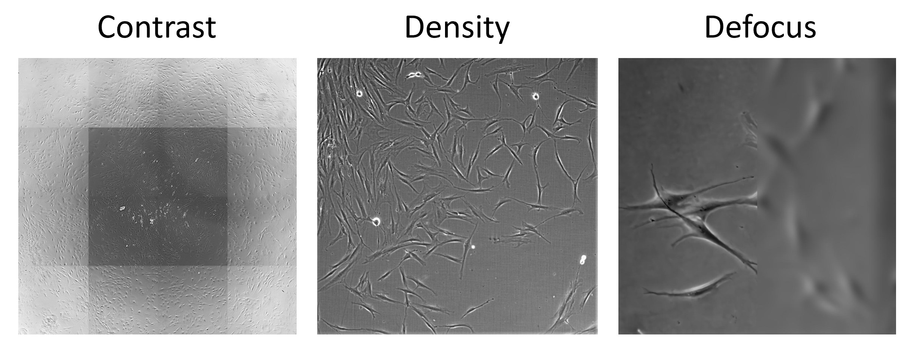

Dynamic confidence threshold
============================

.. attention::
    This is an **advanced** calibration option. If your images have stable contrast, focus and other conditions, you may not need it.

Why a single threshold may not be enough
++++++++++++++++++++++++++++++++++++++++

As explained in the :doc:`Confidence threshold calibration </General information/Confidence threshold calibration>` section, the optimal confidence threshold depends on image properties such as contrast, cell density, and focus.

In many biological experiments, these conditions **vary across frames or even within single images**. Common examples include:

- Uneven illumination across the field of view (darker in the centre, brighter at the edges - common case for phase contrast microscopy with small wells).
- Regions with dense cell clusters versus sparse areas.
- Local defocused areas - the strongest factor changing detection outcome.

Using a **static (fixed) threshold** for the entire stack of images may work well on the image used for calibration, but produce under‑counting or over‑counting in images with different conditions.

The **dynamic threshold** solves this by **adapting the threshold locally** – each small region of the image gets its own optimal threshold, resulting in more accurate counts across the whole image.

    Examples of varying conditions across single image: contrast (illumination), cell density and local defocus.

How does dynamic threshold work?
++++++++++++++++++++++++++++++++

The dynamic threshold algorithm uses calibration image to learn how the optimal threshold varies with local image properties.

**Calibration phase:**

- The calibration image is divided into many small overlapping **patches**, same as in regular calibration.
- **For each patch**, the algorithm finds the optimal **local** threshold – the one that gives the closest count to the ground truth. That way, instead of single optimal threshold, a series of thresholds is stored.
- For adaptation to **defocus**, each patch gets **artificially** blurred with increasing blur strength (set by **Max blur strength** parameter), and optimal threshold is found for these defocused patches.
- It measures **local image features** (contrast, focus metrics, detection densities, etc.).
- It then builds a **model** that can predict, for any new patch, what threshold would be optimal based on its features.
- The whole pipeline gets tested in the same way as in regular calibration.

**Inference phase (prediction on target images):**

- The image is processed with a low confidence threshold to capture all possible detections (this is why prediction can take a little longer with dynamic threshold).
- A **threshold map** is generated – a grid of thresholds, one for each local region.
- Each detection is then accepted or rejected based on the threshold from the region where it lies.

In essence, the algorithm **learns how threshold should vary across the image** from your calibration example and applies that knowledge to new images.

.. note::
    If you expect the dynamic threshold to work well on specific conditions, these conditions should be present in calibration images. However, you don't need to provide defocused images - blur will be applied artificially.

How to use dynamic threshold in NuclePhaser
+++++++++++++++++++++++++++++++++++++++++++

1. Calibration
--------------

Use the **"Calibrate with dynamic threshold"** widget.

- You need a **Points layer** with ground truth annotations – the same as for the standard :doc:`Calibrate with points widget </Widgets/Calibrate with points>`. Use NuclePhaser **Predict** widgets on brightfield of fluorescent images to draft points, and correct them manually if needed.
- The dynamic threshold calibration requires that all target conditions will be present for calibraiton. It also requires more tiles for calibration, so default calibration/test split is set to 0.5.
- After calibration, the widget saves a (``dynamic_threshold.pkl``) in your chosen output folder, as well as test results with different blur strength (**sigma** parameter in Gaussian blur, 0 = no blur) with comparison to static threshold.

.. warning::
    Each .pkl file is valid only for the model it was calibrated on!

2. Inference (applying the dynamic threshold)
---------------------------------------------

In any inference widget (:doc:`Predict on single image </Widgets/Predict on single image>`, :doc:`Predict on 1-stack </Widgets/Predict on 1-stack>`, or :doc:`Predict on 2-stack </Widgets/Predict on 2-stack>`):

- Set **Detection mode** to **"Detection with Dynamic threshold"**.
- In the **Mode file** field, select your ``.pkl`` file from the calibration step.
- Run the prediction as usual.

The inference will automatically generate the threshold map and filter detections locally.

Performance considerations
++++++++++++++++++++++++++

- **Speed:** Dynamic threshold is slightly slower than the static threshold because it uses low confidence threshold, which slows down postprocessing, as well as it spends some time to compute features and build the threshold map.
- **Accuracy:** In heterogeneous images, dynamic threshold often improves counting accuracy (lower MAPE) compared to a global threshold.
- **Calibration effort:** You need to provide **more calibration data** (more frames or a larger image) to get a reliable model. The algorithm needs to see enough variability to learn the relationship between features and thresholds.

Brief technical summary
+++++++++++++++++++++++

1. **Calibration phase:**

   - A set of **image features** is computed for each tile: intensity statistics (mean, std, median, percentiles), texture (entropy, energy), focus (Laplacian variance), and detection densities at thresholds 0.01, 0.1, 0.2, 0.3.
   - The **optimal threshold for each tile** is found by scanning all thresholds from 0.01 to 0.99 and choosing the one that minimises absolute counting - same as in regular calibration.
   - A **k‑NN regressor** (k tuned automatically via cross‑validation from a set of [1, 2, 3, 4, 5]) is trained to predict the optimal threshold from the feature vector. This regressor is saved in .pkl file.

2. **Inference phase:**

   - The prediction on the target image(s) is performed with low confidence threshold to get all detections.
   - A sliding‑window approach (patch size = ``SAHI size / 2``, stride = 0.5) extracts features from all tiles.
   - The trained k‑NN model predicts a threshold for each tile, forming a **threshold map**, where each pixel represents the optimal threshold.
   - For each detection, the threshold is interpolated from the grid using Gaussian weighting from nearby tile centres.
   - The detection is kept only if its confidence ≥ the interpolated threshold.

In other words, k-NN works in the following way. For each new tile, features (contrast, focus, density) of this tile are collected, and the k-NN algorithm uses these features to find the most similar tile (or several tiles) from calibration set.
The optimal threshold for the most similar tile(s) is used for building a threshold map.
