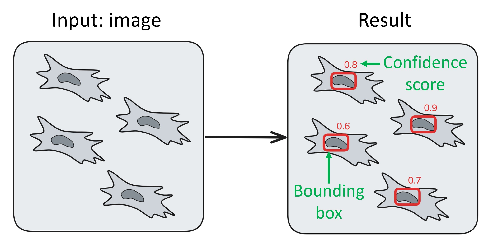

Object detection overview
=========================

Object detection is a computer vision principle, where an algorithm
takes an image as an input and returns an **array**, or **list**, of detected objects
with information about them. In case of NuclePhaser project, this information is
coordinates of **bounding box** for each detected object and **confidence score**, which tells
how sure model is that there is an object in this area.

        How object detection algorithm works, what are bounding box and confidence score.

What object detection algorithms are useful for?
++++++++++++++++++++++++++++++++++++++++++++++++

Object detection algorithms are used in many areas and for different tasks.
They are particularly useful for the task of **counting things** on an image:
they are faster than instance segmentation algorithms, as they don't spend time drawing complex masks;
and they can be easily applied to large images with a lot of objects with :doc:`sliced inference </General information/Sliced inference overview>`.
As we also discovered, they can be easily :doc:`tuned </General information/Confidence threshold calibration>` for specific use cases without training,
which makes them even more convenient.

Another task where object detection algorithms are extremely helpful is **objects tracking**.
Tracking is a computer vision task where an algorithm should connect objects between frames in a series.
Usually it is divided into two subtasks: creating tracking markers for each frame and linking those markers.
Object detection algorithms are great tracking markers creators.

COMBINED GIF

YOLO algorithms
+++++++++++++++

NuclePhaser project utilizes `YOLOv5 <https://github.com/ultralytics/yolov5>`_ and `YOLOv11 <https://github.com/ultralytics/ultralytics>`_ families of object detection algorithms.
YOLO (You Only Look Once) algorithms are designed to be **fast**, so they even work with acceptable speed on CPU.
They come in a variety of sizes (n - nano, s - small, m - medium, l - large, x - extra large), with smallest model being the fastest but least accurate
(in our project, size doesn't always correlate with accuracy).
