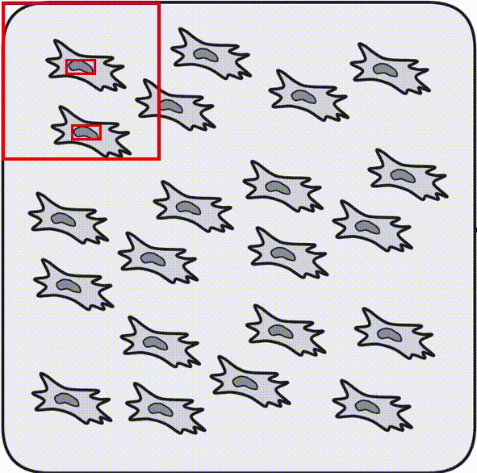

Overview of sliced inference approach
=====================================

Object detection models are taking an image of a certain size as an input.
For example, YOLO models are accepting images 640x640 pixels.
If an image has a different size, it will be resized to 640x640.
But what if I have a large whole-slide image 10000x10000 pixels with thousands of objects?
After compression to 640x640 it will loose all the information.

The simple solution to this problem is **sliced inference**.
Instead of compressing large image, it is divided into small pieces.
These pieces are processed seperately, and then all results are combined into one.

        Animation of sliding window inference. This is how NuclePhaser handles large images behind the scenes.

NuclePhaser utilizes `obss/sahi library <https://github.com/obss/sahi>`_ functionality to perform sliced inference.
In all inference-related widgets of NuclePhaser there are SAHI-related parameters that are described below.
Refer to original `obss/sahi library <https://github.com/obss/sahi>`_, if you have unresolved questions.

**SAHI size** determines the size of the sliding window in pixels.

.. note:: For the rest of the parameters the default ones set up in NuclePhaser widgets are optimal for detecting cell nuclei, as determined from our practice. We recommend changing them only if you shift to other task.

Sliding windows should *overlap*, otherwise the objects on the junctions will be processed incorrectly.
**SAHI overlap** determines the part of the sliding window which would overlap with the next.
SAHI overlap of 0.2 means that windows will overlap by 20% horizontally and vertically.

Since sliding windows are overlapping, there will be some double detections in the overlapping zones.
There is an algorithm for that called **Postprocessing**.

* **NMS (Non-Maximum Suppression)** will delete extra detections.
* **NMM (Non-Maximum Merge)** will merge extra detections into one.
* **GREEDYNMM** is a derivative of NMM. In our practice, it performs better among the three options.

Now there is a question of what should be considered an extra detection.
**Match metric** and **Intersection threshold** are meant for that.
For each pair of intersecting detections, a metric is calculated that determines how heavily they are overlapping.
There are two options for this **Match metric**:

* **IOU (Intersection over Union)**
* **IOS (Intersection over Smaller area)**

The bigger the metrics, the heavier the overlap.

If IOU or IOS is bigger than **Intersection threshold**, detections will be considered overlapping and will be processed by **Postprocess**.

We empirically determined the best combination of parameters for postprocessing in case of cell nuclei: **NMS** with **IOS** threshold **0.34**.
These parameters are set as default in all NuclePhaser >= 0.4.0 widgets.

.. warning::
        NuclePhaser >= 0.4.0 uses an addition to default sahi sliced prediction algorithm - detections that touch border of sliding windows are deleted before postprocessing.
        This is a serious change: optimal combination **NMS**, **IOS** and intersection threshold **0.34** will work only in NuclePhaser >= 0.4.0.
        The other important note: prediction results with same models and parameters from NuclePhaser < 0.4.0 and >= 0.4.0 will not reproduce exactly! There will be slight difference in bounding boxes geometry, but the difference in nuclei count should be minimal (if any).
