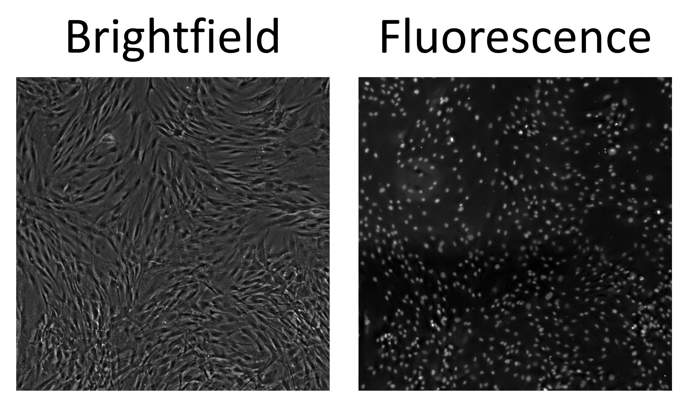

Calibrate with DAPI
===================

Description
+++++++++++

This widget is used for finding optimal confidence threshold of the YOLO model for specific use case (cell type, microscopy options etc.)
Learn more about it at :doc:`Confidence threshold calibration page </General information/Confidence threshold calibration>`.

This option is the most reliable, but at the same time the most demanding.
You need to stain your cells with DAPI or other nuclear fluorescent dye and obtain pair of images brightfield - fluorescent nuclei.

        An example pair of images you need to have for this calibration method.

.. note:: You need a large image for the use of that widget, the larger - the better. At least 6400x6400 pixels is recommended.

Behind the scenes it works the following way. At first, large images (brightfield and fluorescence) are split into an array of small ones.
Part of this array is used for calibration: for each pair, ground truth is derived from fluorescence image and fluorescent nuclei detector, which is used as a "perfect predictor".
For the calibrated model, the confidence threshold returning the closest number of objects to the "perfect predictor" is found.
The result calibrated threshold is calculated as the mean between all calibration small images.

.. figure:: ../Images/Calibration_and_test.jpg
        :scale: 20 %
        :align: center
        :alt: The image didn't load(

        Workflow diagram of Calibrate with DAPI widget.

After calibration, the test algorithm will run. For the test part of small images array, a calibrated model and "perfect predictor" are applied and counting results are compared.
Then two metrics are calculated: `MAPE <https://en.wikipedia.org/wiki/Mean_absolute_percentage_error>`_ and prediction-ground truth scatterplot.
The less the MAPE, the better. In scatterplot, each point represents an image. The closer points are to the red line (imaginary line of perfect predictions), the better.

The widget also saves metadata.txt file with detailed information about calibration run for the reproducibility of results.

Parameters
++++++++++

**Select Phase image** field is used for selecting the brightfield image of your pair.

**Select DAPI image** field is used for selecting the fluorescence image of your pair.

**Phase model** is used for selecting model that will be calibrated.

**DAPI model** is used for selecting the fluorescence nuclei detector that will be used as a "perfect predictor".

.. hint:: Use **Predict on single image** widget beforehand to test and experiment with how this "perfect predictor" you want to use performs.

**Division size** determines the amount of small images that your large images will be split into.
It defines the size of one small image in pixels.
For example, if you have an image 6400x6400 pixels, and Division size = 640, your result array will contain a 100 small images.

**Calibration proportion** determines which part of small images array will be used for calibration, and which part - for test.
If you have an array of 100 small images and Calibration proportion = 0,1, 10 of those images will be used for calibration, 90 - for test.

**Random seed** is used for exact reproduction of data.
The calibration and test parts are divided randomly, using the same random seed will result in the same division.

**DAPI confidence threshold** is used for setting up the confidence threshold of "perfect predictor" model.

.. hint:: Use **Predict on single image** widget beforehand to test and experiment with how this "perfect predictor" you want to use performs.

**Postprocess** field is a part of sliced inference parameters.
It's an optional parameter, learn more at :doc:`page about sliced inference </General information/Sliced inference overview>`.

**Match metric** field is a part of sliced inference parameters.
It's an optional parameter, learn more at :doc:`page about sliced inference </General information/Sliced inference overview>`.

**Intersection threshold** field is a part of sliced inference parameters.
It's an optional parameter, learn more at :doc:`page about sliced inference </General information/Sliced inference overview>`.

**Sahi size** parameter determines the size of the sliding window used for sliced inference.

.. important:: Splitting large images into small ones and sliced inference are completely different and independent processes! For example, if you have Division size of 1280, each of your small images will be processed with sliding window of 640 pixels.

**Sahi overlap** field is a part of sliced inference parameters.
It's an optional parameter, learn more at :doc:`page about sliced inference </General information/Sliced inference overview>`.

**Save folder** is used for selecting a folder in which the calibration plot and metadata.txt files will be saved.
Inside this folder, a subfolder will be created with Expereiment name.

**Experiment name** is used for setting up the subfolder name in **Save folder** for saving the results.
If such folder already exists, will create another subfolder with *Experiment name1* or *Experiment name2* etc.
