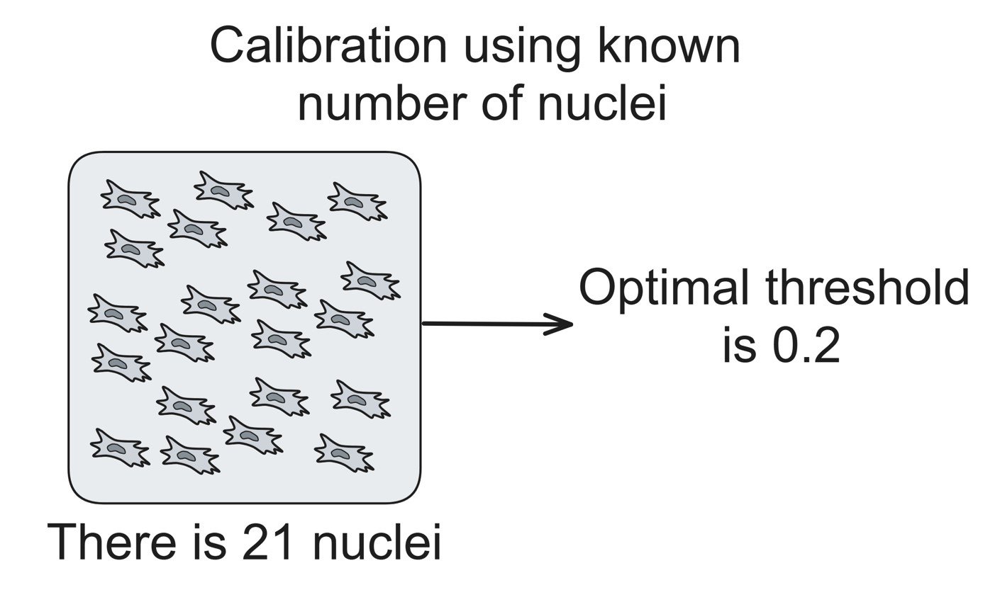

Calibrate with known number
===========================

Description
+++++++++++

This widget is used for finding optimal confidence threshold of the YOLO model for specific use case (cell type, microscopy options etc.)
Learn more about it at :doc:`Confidence threshold calibration page </General information/Confidence threshold calibration>`

This option is the simplest among three, but it doesn't produce accuracy metrics.
The intended task for this widget is calibrating confidence threshold on a **small image**, if there isn't a large one available for calibration.

It takes a calibration image, a number of objects on that image (that was counted beforehand) and a YOLO model and returns an optimal confidence threshold for that model that reutrns closest number of objects to known one.

        Graphic representation of how calibrate with known number widget works.

Parameters
++++++++++

**Select image** field is used for selecting an image to run calibration on.
Accepts only single images, if a stack is chosen, an error will be shown.

**Select model** field is used to select YOLO model that will be calibrated.
Currently only small models (n and s) are available due to the limited size of package on PyPI.
We're currently working on adding larger models.

**Calibration number** field is used to enter the known number of objects.
Widget will return the confidence threshold of the YOLO model that will return a number of objects closest to this number.

.. Tip:: You can use uncalibrated model with **Predict on single image widget**, manually correct the result with Napari set of tools and use **Count points on single image** widget to manually count the number of objects on an image.

**Postprocess** field is a part of sliced inference parameters.
It's an optional parameter, learn more at :doc:`page about sliced inference </General information/Sliced inference overview>`.

**Match metric** field is a part of sliced inference parameters.
It's an optional parameter, learn more at :doc:`page about sliced inference </General information/Sliced inference overview>`.

**Intersection threshold** field is a part of sliced inference parameters.
It's an optional parameter, learn more at :doc:`page about sliced inference </General information/Sliced inference overview>`.

**Sahi size** parameter determines the size of the sliding window used for sliced inference.
Learn more at :doc:`page about sliced inference </General information/Sliced inference overview>`.

**Sahi overlap** field is a part of sliced inference parameters.
It's an optional parameter, learn more at :doc:`page about sliced inference </General information/Sliced inference overview>`.
