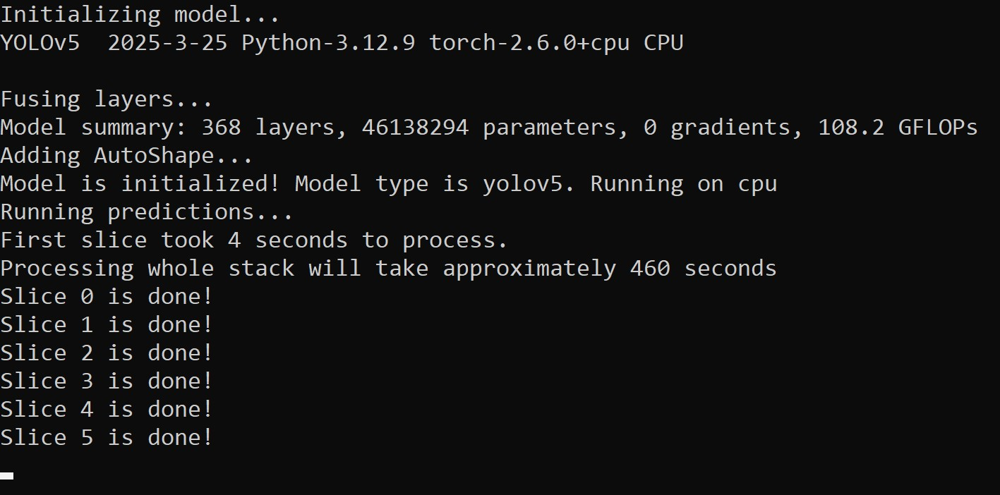

Predict on 1-stack
==================

Description
+++++++++++

This widget is used for running prediction with :doc:`YOLO </General information/Object detection overview>` and :doc:`SAHI </General information/Sliced inference overview>` on one-dimensional stacks of images.
Images could be of any size, there is no lower or upper limit.
An image could be of any format downloadable in Napari (RGB or single channel, 8-bit or 16-bit).

The widget returns detections in form of points (Napari Points layer) for each image in a stack.
The widget can also generate .csv or .xslx file with counting results for each image if the task is to :doc:`count objects </Biological tasks guidelines/Population growth curves>`
Combined with :doc:`Convert points to labels widget </Widgets/Convert points to labels.rst>`, it can generate labels for :doc:`Individual cells tracking </Biological tasks guidelines/Individual cells tracking>`.

.. important:: The widget prints the progress in the command line that you used to initiate the Napari.

        Widget prints the process of running the algorithm in the command line that was used to initiate the Napari.

Parameters
++++++++++

**Select stack** field is used for selecting a stack of images to run inference on.
Accepts only 1-dimensional stack of images, if a single image or 2-dimensional stack is chosen, it will return an error.

**Select model** field is used to select YOLO model that will perform inference.
Currently only small models (n and s) are downloaded automatically due to the limited size of package on PyPI.
Larger models can be downloaded on `NuclePhaser GitHub page <https://github.com/nikvo1/napari-nuclephaser>`_

**Confidence threshold** field is used to set up a confidence threshold for the YOLO model.
Confidence threshold is the **most important paramter** for the task of counting objects.
Learn more about how to find the optimal threshold for your specific use case at :doc:`Confidence threshold calibration page </General information/Confidence threshold calibration>`.

**Use TTA** checkbox is used for running inference with TTA (test-time augmentations). Requires passing metadata_TTA.txt created by Calibrate with points widget.
Learn more at :doc:`page about TTA </General information/Test-time augmentations (TTA)>`.

**TTA metadata file** field is used for passing the metadata_TTA.txt file created by Calibrate with points widget.
Learn more at :doc:`page about TTA </General information/Test-time augmentations (TTA)>`.

**Save result** checkbox is used for selecting whether you need counting results or not.
If the task is to count the number of objects on each frame, check this box.
It will create a subfolder with **Experiment name** at **Save folder** location with .csv and/or .xlsx file with counting results, as well as metadata.txt file with all the parameters for exact reproduction of results.

**Save folder** is used for selecting a folder in which the counting results will be saved if **Save result** box is checked.

**Experiment name** is used for setting up the subfolder name in **Save folder** for saving the results.
If such folder already exists, will create another subfolder with *Experiment name1* or *Experiment name2*.

Further parameters are **advanced settings**. Consider changing them only if you have troubles with default ones.

**Postprocess** field is a part of sliced inference parameters.
It's an optional parameter, learn more at :doc:`page about sliced inference </General information/Sliced inference overview>`.

**Match metric** field is a part of sliced inference parameters.
It's an optional parameter, learn more at :doc:`page about sliced inference </General information/Sliced inference overview>`.

**Sahi size** parameter determines the size of the sliding window used for sliced inference.
Learn more at :doc:`page about sliced inference </General information/Sliced inference overview>`.

**Sahi overlap** field is a part of sliced inference parameters.
It's an optional parameter, learn more at :doc:`page about sliced inference </General information/Sliced inference overview>`.

**Intersection threshold** field is a part of sliced inference parameters.
It's an optional parameter, learn more at :doc:`page about sliced inference </General information/Sliced inference overview>`.

**Points size** parameter determines the size of points in pixels that will be created.

**Save csv** checkbox is used for choosing the counting results saving format. Check it if you want .csv format file. Works only if **Save result** box is checked.

**Save xlsx** checkbox is used for choosing the counting results saving format. Check it if you want .xlsx format file. Works only if **Save result** box is checked.
