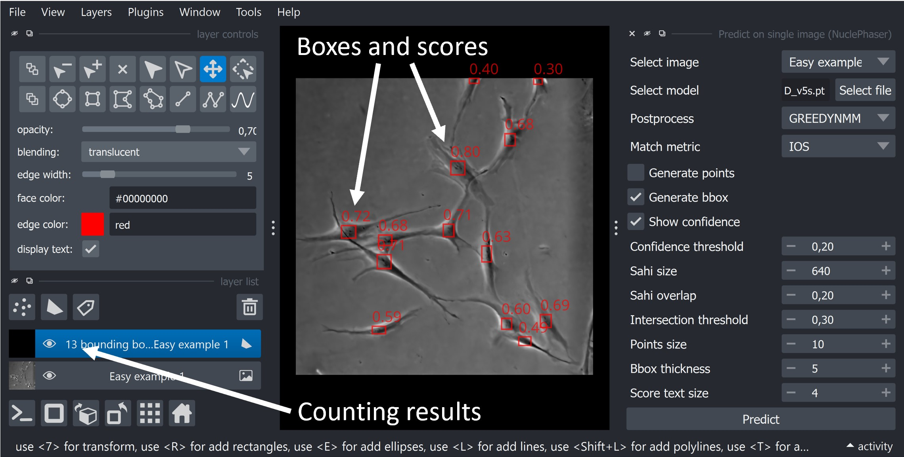
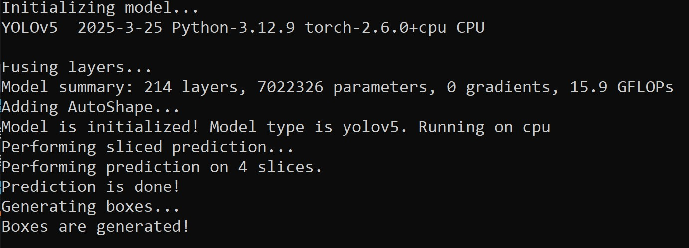

Predict on single image
=======================

Description
+++++++++++

This widget is used for running prediction with :doc:`YOLO </General information/Object detection overview>` and :doc:`SAHI </General information/Sliced inference overview>` on a single image.
An image could be of any size, there is no lower or upper limit.
An image could be of any format downloadable in Napari (RGB or single channel, 8-bit or 16-bit).

The widget returns detections in form of points (Napari Points layer) or bounding boxes (Napari Shapes layer) with or without confidence scores.
It also automatically returns the number of objects detected on an image in **result layer name**.

        Predict on single image widget results. It returns bounding boxes and confidence scores, as well as number of objects in the name of the result layer.

.. important:: The widget prints the progress in the command line that you used to initiate the Napari. Unfortunately, if you're installed Napari as a stanalone application, the widget will run silently.

        Widget prints the process of running the algorithm in the command line that was used to initiate the Napari.

Parameters
++++++++++

**Select image** field is used for selecting an image to run inference on.
Accepts only single images, if a stack is chosen, an error will be shown.

**Select model** field is used to select YOLO model that will perform inference.
Currently only small models (n and s) are available due to the limited size of package on PyPI.
We're currently working on adding larger models.

**Postprocess** field is a part of sliced inference parameters.
It's an optional parameter, learn more at :doc:`page about sliced inference </General information/Sliced inference overview>`.

**Match metric** field is a part of sliced inference parameters.
It's an optional parameter, learn more at :doc:`page about sliced inference </General information/Sliced inference overview>`.

**Generate points** checkbox is used to select the type of widget's output.
Select it if you want to generate Napari Points layer with a point for each detection at the center of the bounding box.

**Generate bbox** checkbox is used to select the type of widget's output.
Select it if you want to generate Napari Shapes layer with a rectangle for each detection representing the bounding box.

**Show confidence** checkbox is used to add confidence scores for each bounding box.
Works only if **Generate bbox** checkbox is active.

**Confidence threshold** field is used to set up a confidence threshold for the YOLO model.
Confidence threshold is the **most important paramter** for the task of counting objects.
Learn more about how to find the optimal threshold for your specific use case at :doc:`Confidence threshold calibration page </General information/Confidence threshold calibration>`.

**Sahi size** parameter determines the size of the sliding window used for sliced inference.
Learn more at :doc:`page about sliced inference </General information/Sliced inference overview>`.

**Sahi overlap** field is a part of sliced inference parameters.
It's an optional parameter, learn more at :doc:`page about sliced inference </General information/Sliced inference overview>`.

**Intersection threshold** field is a part of sliced inference parameters.
It's an optional parameter, learn more at :doc:`page about sliced inference </General information/Sliced inference overview>`.

**Points size** parameter determines the size of points in pixels that will be created if **Generate points** is chosen.

**Bbox thickness** parameter determines the thickness of lines of rectangles if **Generate bbox** parameter is chosen.

**Score text size** parameter determines the size of confidence score text sizes if **Show confidence** parameter is chosen.
